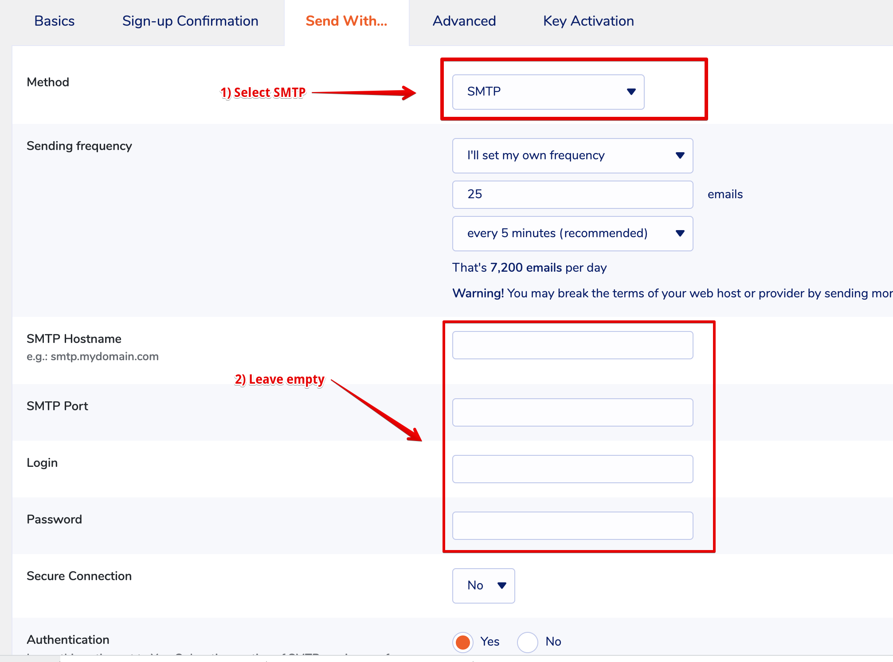

# MU MailPoet SMTP

Set the SMTP transport for MailPoet

## Installation and use

1. Download and save the plugin in `wp-content/mu-plugins`
1. [Edit and set the constants](https://github.com/soderlind/mu-mailpoet-smtp/blob/main/mu-mailpoet-smtp.php#L29-L33), or use the [filters](#filters) to set the SMTP values.
1. Select SMTP as transport in MailPoet and leave the rest of the SMTP config empty.

### MailPoet SMTP

## Filters

You can override the values in the plugin using the following filters:

- mu_mailpoet_smtp_host
- mu_mailpoet_smtp_port
- mu_mailpoet_smtp_encryption
- mu_mailpoet_smtp_username
- mu_mailpoet_smtp_password

## Copyright and License

MU MailPoet SMTP is copyright 2021 Per Soderlind

MU MailPoet SMTP is free software: you can redistribute it and/or modify it under the terms of the GNU General Public License as published by the Free Software Foundation, either version 2 of the License, or (at your option) any later version.

MU MailPoet SMTP is distributed in the hope that it will be useful, but WITHOUT ANY WARRANTY; without even the implied warranty of MERCHANTABILITY or FITNESS FOR A PARTICULAR PURPOSE. See the GNU General Public License for more details.

You should have received a copy of the GNU Lesser General Public License along with the Extension. If not, see http://www.gnu.org/licenses/.

